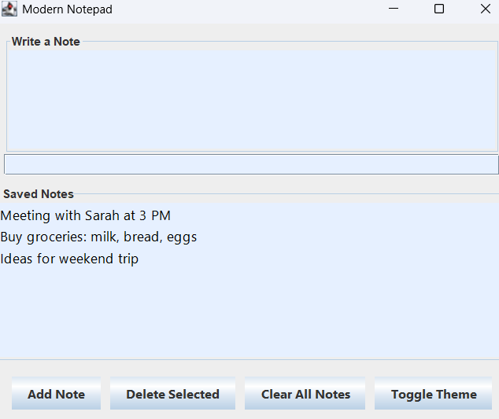
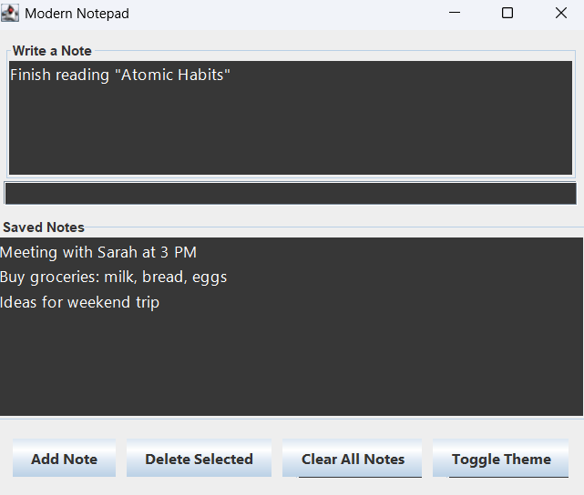

# Simple Notepad App

A basic notepad application built with Java Swing. It allows users to add, view, and delete notes.

## Features
- Add new notes
- Delete selected notes
- Display notes in a list
- 
## 🖼️ Screenshots

## How to Run
1. Clone or download the repository.
2. Compile and run `NotepadApp.java`.
3. Add and delete notes from the interface.

## Dependencies
- Java 8 or higher

## License
[MIT](https://choosealicense.com/licenses/mit/)
